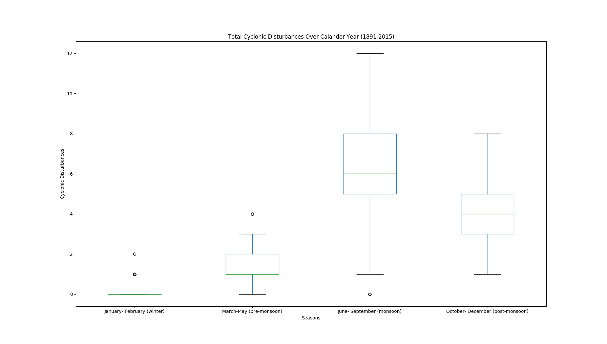

# Research Method (DS200)

The Repository contains Homework for Module 4 of DS200.

### Instructions to Run
1. Clone repository
```
git clone git@github.com:rv-chittersu/ds200.git 
```
2. Extract contents and Install dependencies
```
cd ds200
unzip src.zip
pip3 install -r requirements.txt
```
3. run plots.py
```
python plots.py
```


## Data

The below plots are made by processing data obtained from <https://data.gov.in/node/3994481>. The data contains the frequencies of Cyclonic Disturbances observed in Arabian Sea, Bay of Bengal and Land from 1890 to 2016.

## Plots

### Scatter Plot


**Observation**:\
Above scatter plot shows that Cyclonic Disturbances in Bay of Bengal have been more frequent than than of Arabian Sea over the years of 1891 to 2015.
It can also been seen that occurances of Cyclonic disturbances in Bay of Bengal drops consitently from around year 1950.

### Box Plot



**Observation:**\
Above box plot which consist of data from 125 years shows that Cyclonic Disturbances happen most frequently in mansoon season and very rarely during winter

### Bar Plot


**Observation:** \
Above box plot shows Total Cyclonic Disturbances over the years 2011 to 2015. It can be noted that the Cyclonic Disturbances in Bay of Bengal Contributes more and Cyclonic Disturbances on Land the least.  


## Sources
[1]"Frequency of cyclonic disturbances (depressions and above) over the Bay of Bengal (BOB), Arabian Sea (AS) and land surface of India during 1891-2016", data.gov.in, 2019. [Online]. Available: https://data.gov.in/node/3994481/. [Accessed: 12- Oct- 2019].
[2]"Matplotlib: Python plotting — Matplotlib 3.1.1 documentation", Matplotlib.org, 2019. [Online]. Available: https://matplotlib.org/. [Accessed: 12- Oct- 2019].
